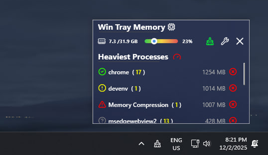
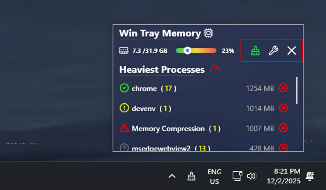
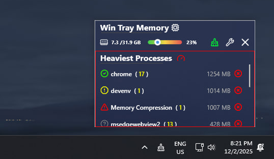
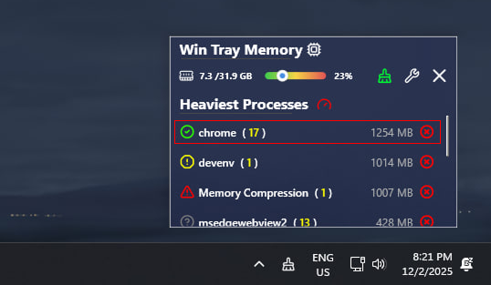
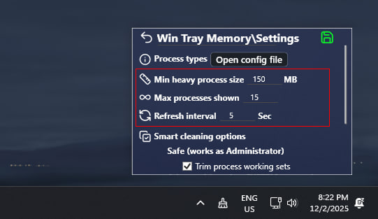
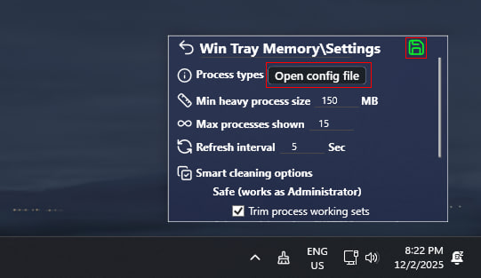
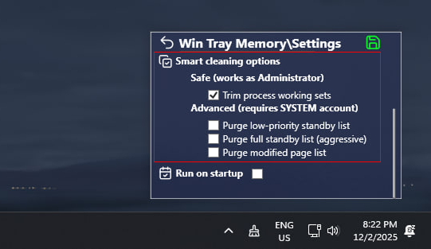
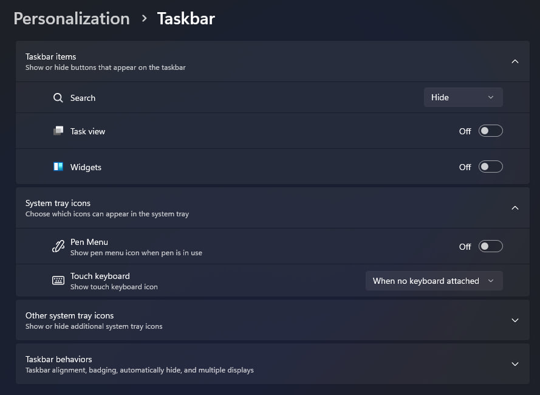
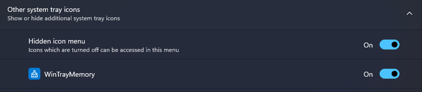
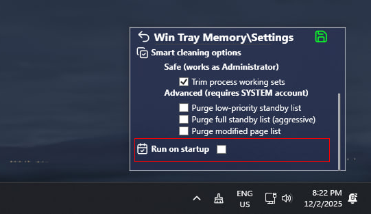

# Windows Tray Memory

Windows Tray Memory is a lightweight yet powerful heavy‑process monitor and RAM cleaner for Windows. It tracks the most memory‑hungry processes in real time, safely frees RAM using native Windows APIs, and lives quietly in the system tray without getting in your way.

  

### 🚀 Features

| Feature | Description |
| --- | --- |
| 🧠 Smart heavy‑process monitor | Tracks the most memory‑hungry processes in real time and keeps the list focused on actual hogs instead of showing everything like Task Manager. |
| 🧹 WinAPI‑based RAM cleaner | Frees memory using documented Windows APIs (such as `EmptyWorkingSet` and `NtSetSystemInformation`) instead of shady registry tweaks or “magic boosters”. |
| 🧷 Safe / Warning / Dangerous categories | Clearly shows how risky it is to kill each process and lets you fine‑tune these lists through a JSON config. |
| ⚙️ Configurable behavior | Lets you control heavy‑process threshold, max items, refresh interval and which memory areas are cleaned when you press Smart cleaning. |
| 📊 Live memory overview | Displays total RAM, current usage in GB and percent with a color‑coded bar so you instantly see when it’s time to clean. |
| 📁 Portable | Single‑folder app — just unzip, run `WinTrayMemory.exe` and keep it in the tray; no installer, services or drivers. |

### How it works (in short)

| Part | Description |
| --- | --- |
| 🔧 Working sets | Uses `EmptyWorkingSet` to trim process working sets, forcing unused pages out and freeing RAM without killing the processes themselves. |
| 📦 Standby & modified lists | Calls `NtSetSystemInformation` with memory‑list commands to purge low‑priority or full Standby lists and the Modified Page List, converting cached pages into truly free memory. |
| 🧩 Config‑driven logic | Reads JSON settings and process‑type lists; changes are picked up on the fly via file watching, so new rules apply without restarting the app. |
| 🧱 WPF + MVVM UI | The tray‑based interface is built with WPF and MVVM, separating UI from logic and keeping the codebase clean and easy to extend. |

## Interface

### Main control window

#### 1. System RAM Information

  

- 📈 **Live RAM overview:** Shows how much memory is currently used vs. total capacity (for example, **7.3 / 31.9 GB**) so you instantly see how loaded your system is.
- 🎨 **Color‑coded usage bar:** The slider changes color depending on memory pressure, making it easy to spot when the system is getting close to its limit.
- 🔢 **Precise percentage:** The value on the right (e.g. **23%**) gives an exact number you can compare before and after smart cleaning.
- 🧠 **Optimization trigger hint:** This area is designed to answer a simple question: “Is it time to press Smart cleaning, or is everything fine for now?”

### 2. Action buttons

  

- 🧠 **Smart cleaning button:** Triggers a powerful but safe memory optimization that calls native Windows APIs such as `EmptyWorkingSet` and `NtSetSystemInformation` to trim working sets and purge Standby / Modified lists without killing system processes. 
- 🛠️ **Quick access tools:** The second button opens the main settings and configuration files, letting you tweak thresholds, cleaning options and process categories in one click.
- ❌ **Close application** The button to completely close the application and remove it from the tray

### 3. Heaviest processes

  

- 🎯 **Focused on memory hogs:** The list shows only the heaviest processes sorted by RAM usage, so you immediately see which apps eat most of your memory. 
- 📊 **Readable per‑app impact:** Each row displays the process name and how many instances are running (for example, `chrome (17)`), plus its exact memory usage in MB on the right. 
- 🔄 **Live updates:** The list refreshes automatically based on the configured interval, keeping the top offenders up to date without reopening Task Manager.

### 4. Single task line

  

- **Category icon on the left:** The colored icon shows how safe it is to kill this process:  
  - 🟢 **Safely** – green circle for everyday apps like browsers or messengers that are usually safe to close.
  - 🟡 **Warning** – yellow icon for editors, games or important tools where you might lose unsaved work.
  - 🔴 **Dangerous** – red icon for critical system processes that should not be killed. 
- **Process name with instance count:** The label (for example, `chrome (17)`) shows the executable name and how many instances are running, so you understand the real impact of that app.
- **Memory usage on the right:** Each line displays the exact RAM usage in MB, making it easy to spot the worst offenders at a glance.
- **Customizable safety lists:** In the settings you can assign any application to Safely / Warning / Dangerous categories, tailoring the classification to your own workflow and making the icons reflect your personal risk rules.

### Settings window

#### General settings

  

- 🧩 **Process types:** Opens the config file where you define which apps are treated as Safely / Warning / Dangerous, so the category icons in the main list follow your own rules.  
- 📏 **Min heavy process size:** Sets the minimum RAM usage (in MB) for a process to be considered “heavy” and appear in the Heaviest Processes list.  
- 📋 **Max processes shown:** Limits how many top heavy processes are displayed at once, keeping the list focused and readable even on busy systems.  
- ⏱️ **Refresh interval:** Controls how often the process list and memory stats are updated (in seconds), balancing responsiveness against CPU usage.

#### Saves & edit config

  

- 📂 **Open config file:** The **Process types** row opens a JSON config where you can assign any app to the Safely, Warning or Dangerous lists, fully customizing how processes are classified.  
- 🔄 **Instant reload:** After you edit and save the config file, WinTrayMemory automatically reloads it in the background — no restart is required, new categories and rules apply immediately.  
- 🔐 **Settings lock:** The lock button prevents accidental changes to settings on shared or production machines while the tool runs in the tray.

#### Smart cleaning options

  

- 🧹 **Safe cleaning (Administrator):** Options like *Trim process working sets* use documented WinAPI calls such as `EmptyWorkingSet` to gently shrink working sets and free RAM without killing any processes.  
- 🚀 **Advanced cleaning (SYSTEM level):** Standby and modified list options (*Purge low‑priority standby list*, *Purge full standby list*, *Purge modified page list*) rely on `NtSetSystemInformation` with memory‑list commands to clear cached pages and turn them into truly free memory.  
- 🎛️ **Per‑flag control:** Each checkbox enables or disables a specific Windows memory API, letting you choose between safer cleaning, aggressive cache purges, or a custom mix for your machine.

## Installation

1. Download the latest stable version from the **Releases** page on GitHub (`WinTrayMemory-0.1.0.zip`).
2. Extract the archive to any folder you like (for example, `C:\Tools\WinTrayMemory`).
3. Run `WinTrayMemory.exe` as Administrator so smart cleaning can use native Windows memory APIs.

> WinTrayMemory is a portable app — no installer, no extra services. Just unzip and run.

## Run in tray on startup

  

  Open <b>Settings → Personalization → Taskbar</b>.

  

  Expand <b>Other system tray icons</b> to see the list of apps that can appear in the notification area.

  

  Find <b>WinTrayMemory</b> in the list and switch it <b>On</b> so the icon is always visible in the system tray.

  

  After enabling it, the WinTrayMemory icon will appear in the taskbar notification area, giving you one‑click access to the main window and smart cleaning.

### Optional: Start with Windows

If you want WinTrayMemory to start automatically with Windows:

### In WinTrayMemory settings
You can use the built-in function in the settings

  

### Or do it manually

1. Press **Win + R**, type `shell:startup` and press **Enter** to open the Startup folder.  
2. Create a shortcut to `WinTrayMemory.exe` inside this folder (right‑click → **New → Shortcut** and browse to the executable).  
3. (Optional) Open the shortcut properties and set **Run:** to **Minimized** so the app goes straight to the tray on startup.
