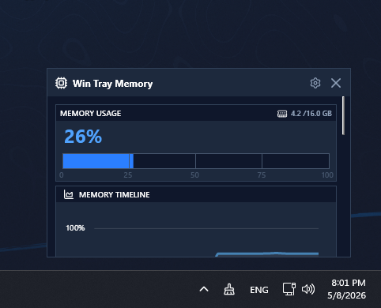

# Windows Tray Memory

Windows Tray Memory is a lightweight yet powerful heavy‑process monitor and RAM cleaner for Windows. It tracks the most memory‑hungry processes in real time, safely frees RAM using native Windows APIs, and lives quietly in the system tray without getting in your way.

  

### 🚀 Features

| Icon | Feature| Description |
| --- | --- | --- |
| 🧠 | Smart heavy‑process monitor | Tracks the most memory‑hungry processes in real time and keeps the list focused on actual hogs instead of showing everything like Task Manager. |
| 🧹 | WinAPI‑based RAM cleaner | Frees memory using documented Windows APIs (`EmptyWorkingSet`, `NtSetSystemInformation`) instead of shady registry tweaks or “magic boosters”. |
| 🧷 | Safe / Warning / System categories | Clearly shows how risky it is to kill each process. Categories can be fine‑tuned through config. |
| ⚙️ | Configurable behavior | Lets you control heavy‑process threshold, max items, refresh interval and which memory areas are cleaned. |
| 📊 | Live memory overview | Displays total RAM, current usage in GB and percent with a color‑coded bar. |
| 📁 | Portable | Single‑folder app — just unzip, run the `.exe` and keep it in the tray. No installer, services or drivers. |
| 🎨 | Complete UI redesign | New colors, modern icons and buttons, clear section separation with headers. |
| 📈 | LiveCharts 2 integration | Charts for better memory data visualization. |
| 🏗️ | Clean MVVM architecture | Strict separation of UI, business logic and data. Each component has its own ViewModel and View. |
| 🗄️ | SQLite + EF Core storage | Replaced JSON configs with a real database. Tables for settings and custom processes. Repositories & services for DB management. |
| 📉 | MemoryUsage | Slider showing available / used memory in percentage. |
| ⏱️ | MemoryTimeline | Line chart of memory usage changes over the last minute. |
| 🥧 | MemoryDetail (Pie Chart) | Pie chart: Applications (Private) 🔴 — actual app memory / Resources (Shared) 🟢 — shared memory (DLLs) / System ⚪ — system memory & cache. |
| 🎯 | MemoryPressure | Semi‑circular gauge: Commit Percent + Hard Faults (pg/s) + status text (Good / Warning / Critical). |
| 🤖 | Auto‑cleanup | Automatic memory cleanup when the configured threshold (percentage) is reached. |
| 🔄 | Update check | Checks if a new version is available. |
| 🚀 | Run on startup | Adds the program to Windows startup. |
| ✚ | Custom processes | Manually add your own processes with type: Safe, Warning or System. |
| 🛡️ | Termination protection | Prevents accidental kills: Warning requires confirmation, System must be enabled in settings first, then confirmed. |

