# Windows Tray Memory

Windows Tray Memory is a lightweight yet powerful heavy‑process monitor and RAM cleaner for Windows. It tracks the most memory‑hungry processes in real time, safely frees RAM using native Windows APIs, and lives quietly in the system tray without getting in your way.

  

### 🚀 Features

| Icon | Feature| Description |
| --- | --- | --- |
| 🧠 | Smart heavy‑process monitor | Tracks the most memory‑hungry processes in real time and keeps the list focused on actual hogs instead of showing everything like Task Manager. |
| 🧹 | WinAPI‑based RAM cleaner | Frees memory using documented Windows APIs (`EmptyWorkingSet`, `NtSetSystemInformation`) instead of shady registry tweaks or “magic boosters”. |
| 🧷 | Safe / Warning / System categories | Clearly shows how risky it is to kill each process. Categories can be fine‑tuned through config. |
| ⚙️ | Configurable behavior | Lets you control heavy‑process threshold, max items, refresh interval and which memory areas are cleaned. |
| 📊 | Live memory overview | Displays total RAM, current usage in GB and percent with a color‑coded bar. |
| 📁 | Portable | Single‑folder app — just unzip, run the `.exe` and keep it in the tray. No installer, services or drivers. |
| 🎨 | Complete UI redesign | New colors, modern icons and buttons, clear section separation with headers. |
| 📈 | LiveCharts 2 integration | Charts for better memory data visualization. |
| 🏗️ | Clean MVVM architecture | Strict separation of UI, business logic and data. Each component has its own ViewModel and View. |
| 🗄️ | SQLite + EF Core storage | Replaced JSON configs with a real database. Tables for settings and custom processes. Repositories & services for DB management. |
| 📉 | MemoryUsage | Slider showing available / used memory in percentage. |
| ⏱️ | MemoryTimeline | Line chart of memory usage changes over the last minute. |
| 🥧 | MemoryDetail (Pie Chart) | Pie chart: Applications (Private) 🔴 — actual app memory / Resources (Shared) 🟢 — shared memory (DLLs) / System ⚪ — system memory & cache. |
| 🎯 | MemoryPressure | Semi‑circular gauge: Commit Percent + Hard Faults (pg/s) + status text (Good / Warning / Critical). |
| 🤖 | Auto‑cleanup | Automatic memory cleanup when the configured threshold (percentage) is reached. |
| 🔄 | Update check | Checks if a new version is available. |
| 🚀 | Run on startup | Adds the program to Windows startup. |
| ✚ | Custom processes | Manually add your own processes with type: Safe, Warning or System. |
| 🛡️ | Termination protection | Prevents accidental kills: Warning requires confirmation, System must be enabled in settings first, then confirmed. |

### How it works (in short)

|Icon | Part | Description |
| --- | --- | --- |
| 🔧 | Working sets | Uses `EmptyWorkingSet` to trim process working sets, forcing unused pages out and freeing RAM without killing the processes themselves. |
| 📦 | Standby & modified lists | Calls `NtSetSystemInformation` with memory‑list commands to purge low‑priority / full Standby lists and the Modified Page List, converting cached pages into truly free memory. |
| 🧩 | Config‑driven logic | Reads settings and process categories from SQLite (previously JSON). Changes are picked up via file/DB watching — new rules apply without restarting the app. |
| 🧱 | WPF + MVVM UI | The tray‑based interface is built with WPF and clean MVVM architecture, separating UI from logic and keeping the codebase clean and easy to extend. |

## Interface

### Main control window

#### 1. System RAM Information & Memory usage

  

- 📈 **Live RAM overview:** Shows how much memory is currently used vs. total capacity (for example, **4.2 / 16.0 GB**) so you instantly see how loaded your system is.
- 🎨 **Color‑coded usage bar:** The slider changes color depending on memory pressure, making it easy to spot when the system is getting close to its limit.
- 🔢 **Precise percentage:** The value on the right (e.g. **26%**) gives an exact number you can compare before and after smart cleaning.
- 🧠 **Optimization trigger hint:** This area is designed to answer a simple question: “Is it time to press Smart cleaning, or is everything fine for now?”

### 2. Memory Timeline

  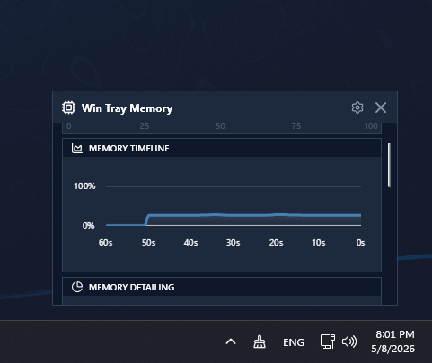

- ⏱️ **60 seconds of history:** The chart shows how your RAM usage has changed over the last minute. Left side – almost a minute ago, right side – right now.
- 🔄 **Live updates:** Data refreshes every second, so you see load changes in real time.
- 📊 **Percentage scale:** The vertical axis goes from 0 to 100% – you instantly know how loaded the memory is at any given moment.
- 🎨 **Smooth line with gradient fill:** The line is perfectly smoothed with no sharp angles, and the area under it has a gradient fill – making it easier to visually track the overall load trend.
- 🧹 **Clean & minimal:** No extra data markers or clutter – just a pure line so nothing distracts from what really matters: how memory usage changes over time.

In simple words: you can immediately see whether memory is going up, going down, or staying steady, and decide when it's time to hit Smart cleaning – or if everything is still fine.

**Example**

  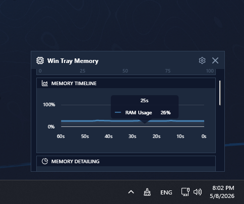

### 3. Memory detailing

  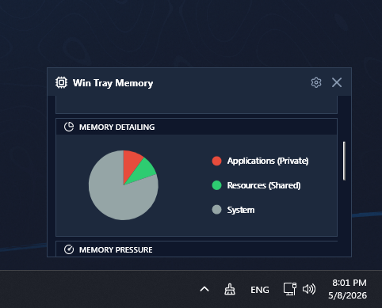

- 🥧 **MemoryDetail – what your used memory consists of**
  
- 🔴 **Applications (Private):** Real memory taken by your apps — private working sets that cannot be given to other processes. This is what you can free by closing programs.
-🟢 **Resources (Shared):** Shared memory — DLLs and common resources used by multiple applications at the same time. They only get freed when all programs that use them are closed.
- ⚪ **System:** System memory and file cache — what Windows reserves for its own needs. This is not "junk" but an essential part of how the OS works.

In simple words: you immediately see who exactly is eating your RAM — your apps, shared libraries, or the system itself. This helps you decide whether cleaning makes sense or the real issue is a specific program, not just "cache junk".

### 4. Memory pressure

  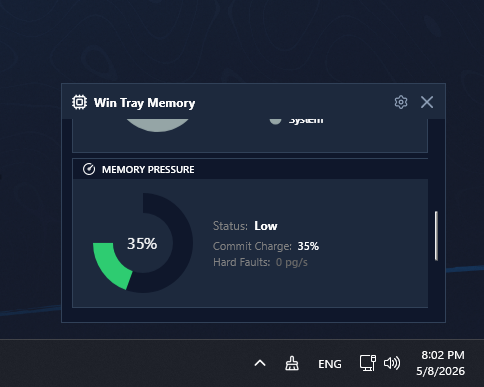

- 🎯 MemoryPressure – memory pressure gauge

- 📊 **Commit Percent:** Shows how much virtual memory the system has committed to processes relative to the total limit (RAM + page file). The higher the percentage — the closer the system is to its limit.
- ⚡ **Hard Faults (pg/s):** Page faults per second. Simply put — how often the system has to go to the disk for data because it didn't fit in RAM. Higher numbers mean heavier memory pressure.
- 🎨 **Semi-circular gauge:** A very visual indicator — like a tachometer in a car. Green zone = everything is fine, yellow = attention needed, red = critical.
- 💬 **Text status:** Next to the gauge, you'll see a simple verdict: "Low", "Moderate", "High", or "Critical" — even if you don't understand technical numbers, you instantly know what's happening with your system.
  
In simple words: this gauge answers "Is it time to do something yet?". High pressure means your system is slowing down because it's constantly hitting the disk instead of using RAM. That's the perfect time to hit Smart cleaning.

### 5. Actions & Heaviest Processes

  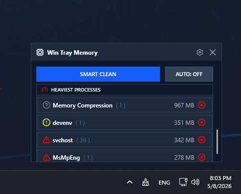

🧹 **Smart cleaning & Auto-cleanup**
- 🔘 **Smart cleaning – manual mode:** One big blue button on the main screen. Click it — and the system immediately starts memory optimization using native Windows APIs (EmptyWorkingSet, NtSetSystemInformation). Instant, safe, no process killing.
- 🤖 **Auto-cleanup – automatic mode:** The toggle switch next to it puts the app into "smart" mode. Set a threshold in settings (e.g., 85% memory usage), and when the load reaches that value — cleanup runs automatically. No reminders, no extra clicks.

In simple words: want to stay in control — hit Smart cleaning. Want to forget about the problem — turn on Auto-cleanup and sleep well. The app will take care of memory when it's actually needed.

**Process Line:**
- **Category icon on the left:** The colored icon shows how safe it is to kill this process:  
  - 🟢 **Safely** – green circle for everyday apps like browsers or messengers that are usually safe to close.
  - 🟡 **Warning** – yellow icon for editors, games or important tools where you might lose unsaved work.
  - 🔴 **Dangerous** – red icon for critical system processes that should not be killed. 
- **Process name with instance count:** The label (for example, `svchost (17)`) shows the executable name and how many instances are running, so you understand the real impact of that app.
- **Memory usage on the right:** Each line displays the exact RAM usage in MB, making it easy to spot the worst offenders at a glance.
- **Customizable safety lists:** In the settings you can assign any application to Safely / Warning / Dangerous categories, tailoring the classification to your own workflow and making the icons reflect your personal risk rules.

### 6. Tray tooltip

  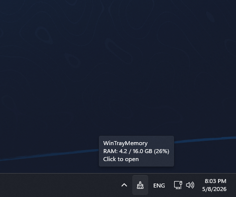

🔔 Tray tooltip – quick info without opening the window

- 🖱️ **Hover over the tray icon** — and you immediately see: total RAM, current usage in GB, and percentage.
- ⚡ **No extra steps:** No need to open the app just to check the situation. Just glance at the tray — and you know whether it's time to clean memory or everything is fine.
- 📊 **Format example:** 4.2 / 16.0 GB (26%) — clean, informative, no fluff.

### Settings window

⚙️ - For your convenience, the settings are divided into thematic sections; you can open and configure each one.

  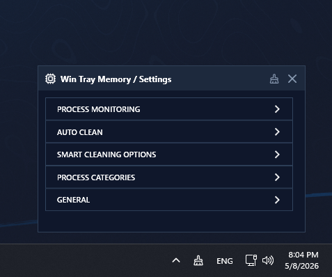

#### Process monitoring

  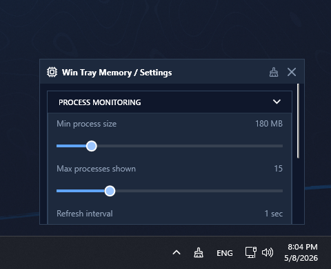

- 📊 **Min process size (MB):** Sets the minimum process size in megabytes to be included in the "heavy" processes list. Smaller processes are simply ignored — you only see the real memory hogs.
- 📋 **Max processes shown: Limits** the number of displayed processes in the list. No need to scroll through endless tables — just the top memory‑hungry applications.
- ⏱️ **Refresh interval (seconds):** How often the process list updates. Set it short for maximum responsiveness or longer to reduce system load.

### Auto-clean options

  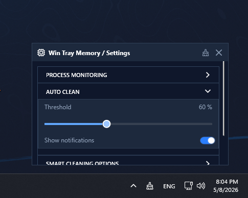

- 📊 **Threshold (%):** Set the memory usage percentage threshold. When RAM usage reaches this value — the app automatically triggers a cleanup. For example, set it to 85% — and as soon as memory hits 85%, Smart cleaning runs.
- 🔔 **Show notification:** Enables or disables notifications when auto-cleanup runs. Want to know when the app takes action — turn it on. Prefer no extra alerts — turn it off.

#### Smart cleaning options

  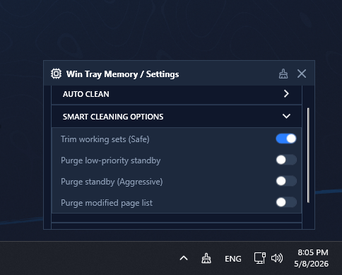

- 🧹 **Safe cleaning (Administrator):** Options like *Trim process working sets* use documented WinAPI calls such as `EmptyWorkingSet` to gently shrink working sets and free RAM without killing any processes.  
- 🚀 **Advanced cleaning (SYSTEM level):** Standby and modified list options (*Purge low‑priority standby list*, *Purge full standby list*, *Purge modified page list*) rely on `NtSetSystemInformation` with memory‑list commands to clear cached pages and turn them into truly free memory.  
- 🎛️ **Per‑flag control:** Each checkbox enables or disables a specific Windows memory API, letting you choose between safer cleaning, aggressive cache purges, or a custom mix for your machine.

#### User process rule

  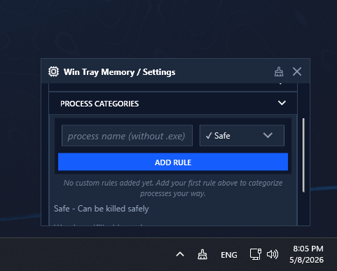

- ➕ **Add your own processes:** The app comes with a basic set of system processes, but your favorite app might not be in the list. Just enter the process name (without .exe), choose a category — and add it.
- 🏷️ **Three categories to choose from:**
    - ✓ **Safe** — safe processes, can be killed without risk
    - ⚠ **Warning** — processes that require caution (confirmation required)
    - ✕ **System**— critical system processes (cannot be killed by default, must be enabled in settings first)

- 🗑️ **Remove rules:** Any custom rule can be removed — the process will revert to default behavior or disappear from the list.
- 💾 **Saved to SQLite:** All your rules are stored in the database and applied every time the app starts.

#### General settings

  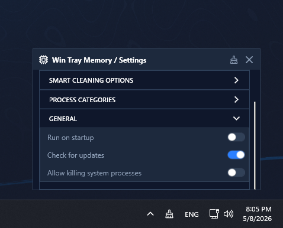

- 🚀 **Run on startup:** Adds the app to Windows startup. Turn it on — the app launches with your system and sits in the tray. No need to remember to start it manually.
- 🔄 **Check for updates:** Automatically checks if a new version is available. When an update comes out — you'll be the first to know.
- 🛡️ **Allow kill system processes:** A very important switch. By default, you cannot kill system processes — the app protects you from yourself. But if you're an advanced user and know exactly what you're doing — enable this option, and terminating System‑type processes becomes available (but still requires confirmation).

## Installation

1. Download the latest stable version from the **Releases** page on GitHub (`WinTrayMemory-0.2.0.zip`).
2. Extract the archive to any folder you like (for example, `C:\Tools\WinTrayMemory`).
3. Run `WinTrayMemory.exe` as Administrator so smart cleaning can use native Windows memory APIs.

> WinTrayMemory is a portable app — no installer, no extra services. Just unzip and run.

## Run in tray on startup

  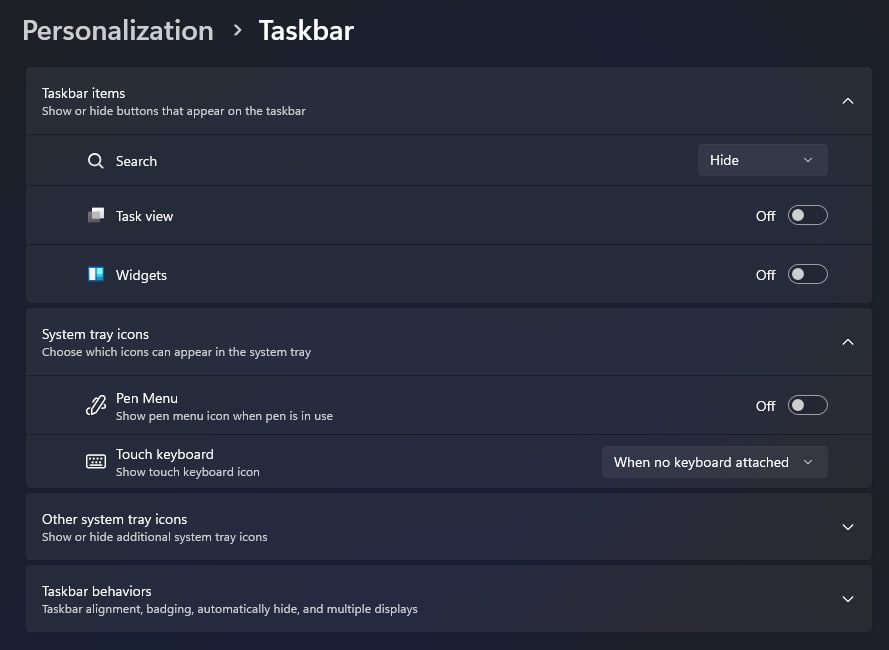

  Open <b>Settings → Personalization → Taskbar</b>.

  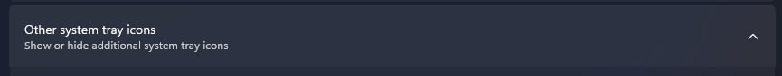

  Expand <b>Other system tray icons</b> to see the list of apps that can appear in the notification area.

  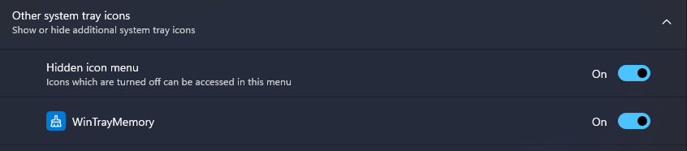

  Find <b>WinTrayMemory</b> in the list and switch it <b>On</b> so the icon is always visible in the system tray.

  

  After enabling it, the WinTrayMemory icon will appear in the taskbar notification area, giving you one‑click access to the main window and smart cleaning.

### Optional: Start with Windows

If you want WinTrayMemory to start automatically with Windows:

### In WinTrayMemory settings
You can use the built-in function in the settings

  

### Or do it manually

1. Press **Win + R**, type `shell:startup` and press **Enter** to open the Startup folder.  
2. Create a shortcut to `WinTrayMemory.exe` inside this folder (right‑click → **New → Shortcut** and browse to the executable).  
3. (Optional) Open the shortcut properties and set **Run:** to **Minimized** so the app goes straight to the tray on startup.
